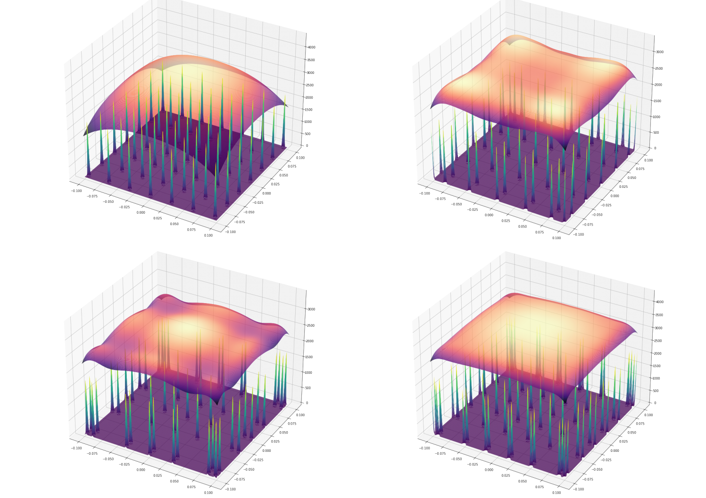
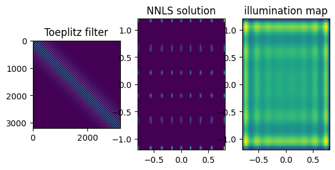
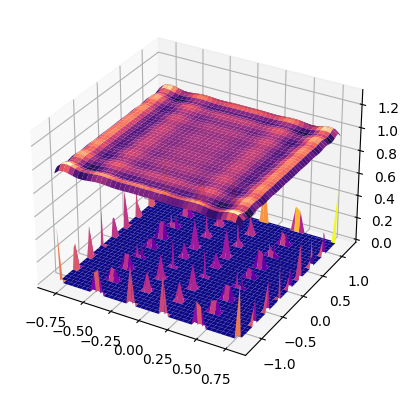

# UILC

**U**niform **I**llumination **L**ight **C**alcuation

  

## About The Project

Uniform irradiation light sources are widely used in many industrial and research fields. 
This project is a python implementation of finding LED locations of array that produces unifrom irradiation on the target plane.
It was mainly focused on application on DIY LED backlight unit design in 3D printing area.
The project was begined in 2021 to solve the engineering problem of the uniform backlight
of simple LCD lesin printer.

Theorical backgtrounds and further reading sources are written in `theories.ipynb` file in `/docs` directory.

### Language and library dependencies

**Language** 
* python3

**pre-request library for implementation**

* numpy
* scipy

## Usage

For more details and examples, please refer to the `usage.ipynb` file in the `/docs` directory.

The `/test` documents are basic tests history and 
contents about each modules in the uilc *method* modules.

## License

It is distributed with MIT License. The full text can refer to the `LICENSE` file.

## Theorical Background

See details of implementation and theorical background in `/docs/theories.ipynb`

There are further resources related with
the project.

See the below preprent for a positive solution equations and about 2D-convolution and toeplitz conversion, [Convolution: Introduction and implementation](https://gist.github.com/HYUNSEONG-KIM/fb41d2c0c71b67b75a25e8409fdfddc1)

## Publication

* July/2022: Poster, “Design methods of uniform illumination light device with LEDs: boundary center matching and distribution approximation”, [Optics and Photonics Congress 2022 ICC JEJU](https://www.osk.or.kr/conference/event/index.php?cfrid=34), [Optics Society of Korea](https://www.osk.or.kr/), TPP-II-09.

* Preprint, Hyunseong Kim. (2023). Properties of Gauss Hypergeometric function, 2F1, of special parameters. Zenodo. https://doi.org/10.5281/zenodo.8025131

See documents in `docs` directory or the above repository.